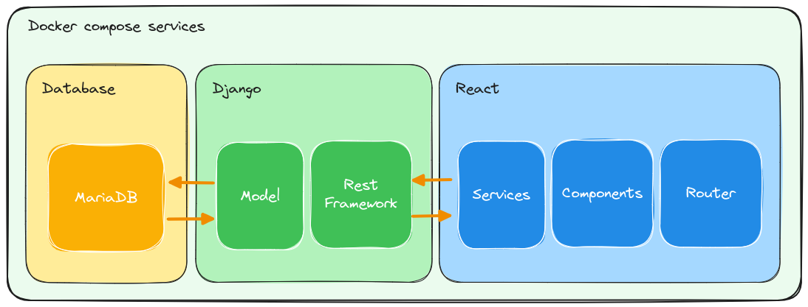

# Posts and comments app
This project is little clone of reddit post and comments functionality.

## Commits convention

Commit types

- 📃: Documentation
- 🐛: Bug fix
- 🎨: Style
- 🔁: Refactor
- 🔧: Config

Commit scopes

- 🐋: Docker
- 🔌: Backend
- 🖥️: Frontend
- 🗄️: Database
- 🧰: Admin

Commit structure

```
<type>(<scope>): <subject>
```

Example commit

```
📃: Add commit convention to README.md
🐛(🔌): Fix bug in post creation
```

## Technologies involved

- React
- Javascript
- Django
- Python
- MariaDB
- SQL
- Docker
- Shell

## Architecture design

The architecture of the system is based on the microservices architecture. The system is divided into three main parts: frontend, backend and database. The frontend is written in React, the backend in Django and the database is MariaDB. The frontend and backend are running in docker containers. Frontend is running on port 3000, Database is running on port 3306. and backend on port 8000. The frontend is communicating with the backend via REST API. The backend is communicating with the database via ORM.


